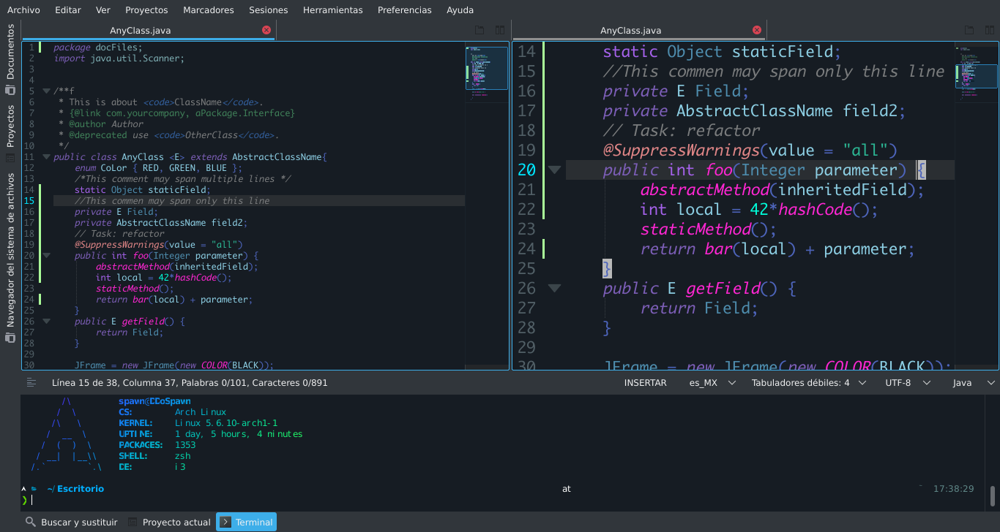

## DarkBlueSpvwn-KateColorScheme



## Descripción

Este es un tema oscuro para Kate que se encuenta en fase beta, por el momento su principal lenguaje es JAVA, pero con el tiempo agregaré soporte a más lenguajes como Python, PHP, BASH Script, JavaScript, HTML y CSS. Si te gusta, disfrutalo.

## Requisitos previos

- Tener instalado Kate
- Tener instalado la font: ```ttf-monaco```

**Instalación en Arch Linux con yay**

	yay -S ttf-monaco --noconfirm --needed

**Instalación en otras distribuciones**

	Dirígete [aquí](https://gist.github.com/rogerleite/99819)

## ¿Qué es Kate?

"Kate is a multi-document, multi-view text editor by KDE. It features stuff like codefolding, syntaxhighlighting, dynamic word wrap, an embedded console, an extensive plugin interface and some preliminary scripting support."
	-Official KDE PLASMA page.

***O por su tracucción:***

*Kate es un editor de texto de múltiples documentos y múltiples vistas de KDE. Cuenta con elementos como plegado de códigos, resaltado de sintaxis, ajuste dinámico de palabras, una consola integrada, una amplia interfaz de complementos y algo de soporte de secuencias de comandos preliminar.*

## Instalación

### Instalación manual

Teniendo abierto `Kate` :
1. Si tenemos instalado Git, podemos clonar el repositorio directamente con ```git clone https://github.com/spawmc/DarkBlueSpvwn-KateColorScheme.git``` o simplemente pulsar en ```Clonar o descargar``` y dar clic en ```Descargar ZIP```

2. Dentro de la barra de menu, abriremos la pestaña ```Preferencias```.
3. Entramos la opción de ```Configurar Kate```


4. En el panel lateral izquierdo abrimos ```Componente de edicion``` y entramos a ```Tipos de letra y colores```


5. Pulsamos en ```Ìmportar...```


6. Y nos mostrará un gestor de archivos, buscamos el directorio donde se extrajo o descargó el archivo .kateschema y seleccionamos ```DarkBlueSpvwn.kateschema```

7. Ahora solo debemos seleccionarlo en la opción llamada ```Esquema predeterminado para Kate:```


8. Y listo, ya podemos comenzar a trabajar con nuestro editor :)


## Desarrollo

Puedes seguir modificando el esquema de color dentro de ```Tipos de letra y colores```, ahí podrás hacer las modificaciones adicionales que necesites.

Con el tiempo iré agregando soporte para más lenguajes.

## Sobre mi SO

Actualmente utilizo Arch Linux con i3-gaps, para modificar la GUI de las aplicaciones hechas en el maravilloso Qt utilizo ```Qt5ct```, pero si estás utilizando un DE como Plasma puedes modificar la GUI de las aplicaciones utilizando la propia herramienta de configuración del entorno.


## Contacto para recomendaciones o errores

Correo:
	```spawnmcswitch@gmail.com```


Telegram:
	```https://t.me/spawnmc```